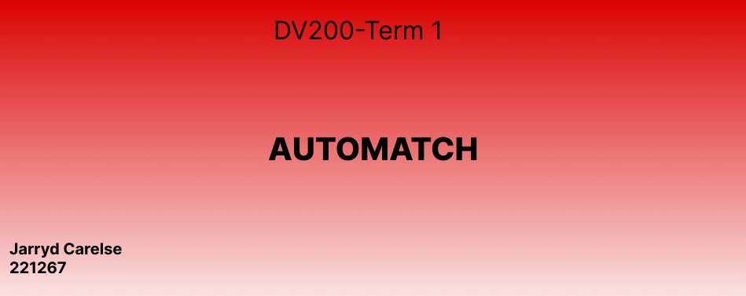

# Term1_DV200_JarrydCarelse_221267
Term 1 Project readMe file with Demo Video

<h5 align="center" style="padding:0;margin:0;">Jarryd Carelse</h5>
<h5 align="center" style="padding:0;margin:0;">221267</h5>
<h6 align="center">DV200 2023</h6>
</br>
<p align="center">

  
  
  <h3 align="center">DV200 Term 1</h3>

  <p align="center">
    AutoMatch is an intuitive website that lets you compare two cars simultaneously. It provides comprehensive information and insightful graphs for easy analysis. The timeline feature offers a historical perspective on the cars' evolution. Whether you're a car enthusiast or a potential buyer, Auto Match is a valuable tool for making informed decisions and finding your perfect match.
 <br>
    
   <br />
   <br />
   <a href="path/to/demonstration/video">View Demo</a>
    ·
    <a href="https://github.com/username/projectname/issues">Report Bug</a>
    ·
    <a href="https://github.com/username/projectname/issues">Request Feature</a>
</p>
<!-- TABLE OF CONTENTS -->
## Table of Contents

* [About the Project](#about-the-project)
  * [Project Description](#project-description)
  * [Built With](#built-with)
* [Getting Started](#getting-started)
  * [Prerequisites](#prerequisites)
  * [How to install](#how-to-install)
* [Features and Functionality](#features-and-functionality)
   * [Wireframes](#wireframes)
* [Development Process](#development-process)
   * [Implementation Process](#implementation-process)
        * [Highlights](#highlights)
        * [Challenges](#challenges)
   * [Future Implementation](#peer-reviews)
* [Final Outcome](#final-outcome)
    * [Mockups](#mockups)
    * [Video Demonstration](#video-demonstration)
* [Conclusion](#conclusion)
* [License](#license)
* [Contact](#contact)


<!--PROJECT DESCRIPTION-->

### Project Description

AutoMatch is an intuitive website that lets you compare two cars simultaneously. It provides comprehensive information and insightful graphs for easy analysis. The timeline feature offers a historical perspective on the cars' evolution. Whether you're a car enthusiast or a potential buyer, Auto Match is a valuable tool for making informed decisions and finding your perfect match.


### Built With

* VS Code
* React.js
* Javascript
* Css
* Chart.js
* Bootstrap
* Figma

<!-- GETTING STARTED -->
<!-- Make sure to add appropriate information about what prerequesite technologies the user would need and also the steps to install your project on their own mashines -->
## Getting Started

The following instructions will get you a copy of the project up and running on your local machine for development and testing purposes.

### How to install

### Installation
Here are a couple of ways to clone this repo:

1. Software </br>
`Android Studio` -> `File` -> `New` -> `From Version Control` -> `Git`</br>
Enter `https://github.com/username/projectname.git` into the URL field and press the `Clone` button.

2. Clone Repository </br>
Run the following in the command-line to clone the project:
   ```sh
   git clone https://github.com/username/projectname.git
   ```
    Open `Software` and select `File | Open...` from the menu. Select cloned directory and press `Open` button

3. Install Dependencies </br>
Run the following in the command-line to install all the required dependencies:
   ```sh
   npm install
  
<!-- FEATURES AND FUNCTIONALITY-->

### The section where one can select two cars and compare them side by side.


### Using Chart.js you can select a car you would like to view information on and it gives you the information in a form of a line chart.


## Development Process

##Design Phase
Ideation: I began the project with a brainstorming phase to define the goals, features, and user experience I wanted to achieve with the comparison website. This helped me clarify my project scope and objectives.

Wireframe Design with Figma: Using Figma, I created wireframes and prototypes of the user interface. These wireframes served as a blueprint for the design and layout of the website.

##Development Phase
Setting Up the React App: I initiated the project by creating a new React application. This provided a solid foundation for building the website.

Implementing Chart.js: To display car comparison data in a visually appealing way, I integrated Chart.js into my React app. Chart.js allowed me to create interactive and dynamic charts to present the information effectively.

API Integration: I connected the application to an API to obtain information about the cars for comparison. This included fetching and processing data from the API to populate the website with relevant car information.

Building the Comparison Features: I implemented features that allow users to select and compare two cars. Users can specify criteria and view the comparison results in the form of charts.

User Interface Development: I translated the wireframes created in Figma into actual components and user interface elements in my React app. This included the design and layout of the website, ensuring it was both visually appealing and user-friendly.

Testing and Debugging: Throughout the development process, I rigorously tested the application to identify and fix any bugs or issues that arose.

#### Challenges
##Challenges Faced
During the development of this project, I encountered several challenges that required creative problem-solving and perseverance. Here are some of the notable challenges I faced:

*API Integration: Integrating an external API to obtain car comparison data was a complex task. I had to ensure proper API requests, handle responses, and manage data retrieval effectively. Debugging and testing were essential to address issues related to API integration.

*Chart.js Data Integration: Configuring Chart.js to use the data retrieved from the API presented a significant challenge. I had to carefully format and render the data in the charts, ensuring it was presented in a clear and informative manner.

*Responsive Design: Creating a responsive design that worked well on various screen sizes and devices required careful consideration. Ensuring that the website was user-friendly and visually appealing on both desktop and mobile platforms was a continuous challenge.

<!-- MOCKUPS -->
## Final Outcome

### Mockups

<br>

<br>


<!-- VIDEO DEMONSTRATION -->
### Video Demonstration

To see a run through of the application, click below:

[View Demonstration](https://drive.google.com/file/d/1NGFQRjZjbKTZfkI7rD953dGHe0_uxuZx/view?usp=sharing 
)

<!-- AUTHORS -->
## Authors

* **Jarryd Carelse** 

<!-- LICENSE -->
## License

Distributed under the MIT License. See `LICENSE` for more information.\

<!-- LICENSE -->
## Contact

* **Jarryd Carelse** - [221267@virtualwindow.co.za](mailto:email@address)

